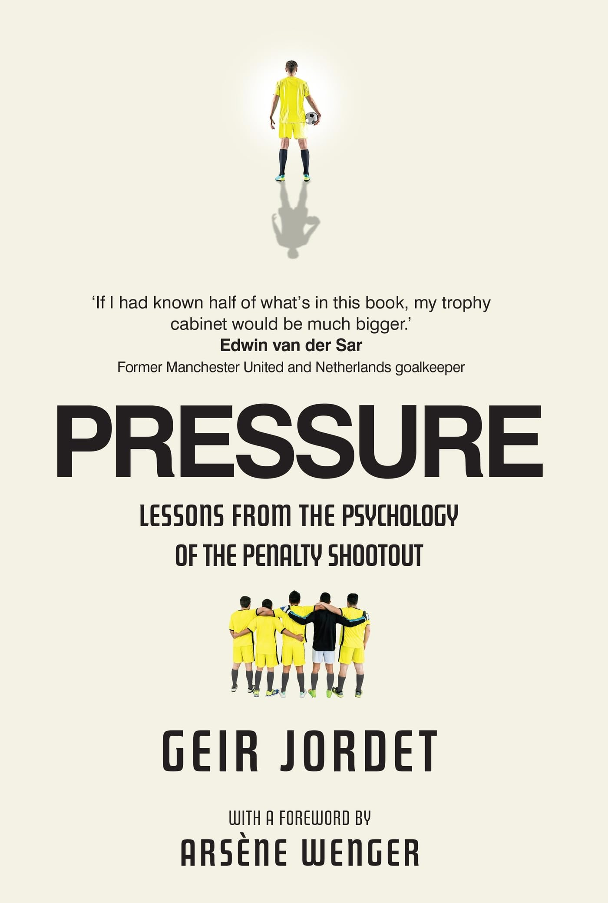

  

# Pressure: Lessons from the psychology of the penalty shootout by Geir Jordet
This repo contains the publicly available papers and articles cited in the [Pressure: Lessons from the psychology of the penalty shootout](https://www.susannalea.com/sla-title/pressure/) by Geir Jordet.(for some of them, you need to require access from the authors through Research Gate or access them through IEEE memberships and such) 
**The purpose of this repo is to serve as a complimentary resource for ease of access when you're reading the book.
Please contact me know if you're one of the authors and want your papers' links removed. Please note that the hyperlink titles only include references titles and the year published in order to make your search convenient. Please remember to cite them properly in your works.
Please give this repo a star if you found it helpful!**

# About this book

The penalty shootout is the most intense drama in sport. The anxious wait, the building dread, the lonely, heavy-legged walk towards the penalty spot. One kick while the world holds its breath. Even football's most casual observers cannot escape the nerve-wracking suspense. 
What happens to a footballer's brain and body in these heart-pounding moments of pressure? Why do some thrive while others choke? 
In this ground-breaking book, sport psychology Professor Geir Jordet dissects each agonising element of the shootout's duel and the universal human stress mechanisms that it triggers and illuminates. Drawing on two decades of studying the atomic nuances of performance under pressure, Jordet's vivid case studies take you behind the scenes of football's most nail-biting moments. He interviews superstars and shares stories from his work with top teams and some of the world's best players. 
In the penalty shootout, as in life, it is often the tiny, seemingly invisible decisions that impact success and failure. After reading this book, you will have fresh insights and a newly acquired understanding of those dreaded moments when the pressure builds - how to handle them.

# Bibliography

🔹 [Chocking Under Pressure: Self-Consciousness and Paradoxical Effects of Incentives on Skillful Performance (1984)](https://www.researchgate.net/publication/16488199_Chocking_Under_Pressure_Self-Consciousness_and_Paradoxical_Effects_of_Incentives_on_Skillful_Performance) 
🔹 [Preperformance Routines in Sport: Theoretical Support and Practical Applications (1990)](https://journals.humankinetics.com/view/journals/tsp/4/3/article-p301.xml) 
🔹 [The Need to Belong: Desire for Interpersonal Attachments as a Fundamental Human Motivation (1995)](https://www.researchgate.net/profile/Mark-Leary-2/publication/15420847_The_Need_to_Belong_Desire_for_Interpersonal_Attachments_as_a_Fundamental_Human_Motivation/links/5b647053aca272e3b6af9211/The-Need-to-Belong-Desire-for-Interpersonal-Attachments-as-a-Fundamental-Human-Motivation.pdf) 
🔹 [When Paying Attention Becomes Counterproductive: Impact of Divided Versus Skill-Focused Attention on Novice and Experienced Performance of Sensorimotor Skills (2002)](https://www.researchgate.net/publication/11362554_When_paying_attention_becomes_counterproductive_Impact_of_divided_versus_skill-focused_attention_on_novice_and_experienced_performance_of_sensorimotor_skills) 
🔹 [A Statistician Reads the Sports Pages:The Cold-Foot Effect (2004)](https://www.tandfonline.com/doi/abs/10.1080/09332480.2004.10554926) 
🔹 [Neurobiological Substrates of Dread (2006)](https://pmc.ncbi.nlm.nih.gov/articles/PMC1820741/pdf/nihms18806.xml.fixed.pdf) 
🔹 [Penalty shooting and gaze behavior: Unwanted effects of the wish not to miss (2006)](https://www.researchgate.net/profile/Frank-Bakker/publication/289678122_Penalty_shooting_and_gaze_behavior_Unwanted_effects_of_the_wish_not_to_miss/links/60730d1d4585150fe99f24b0/Penalty-shooting-and-gaze-behavior-Unwanted-effects-of-the-wish-not-to-miss.pdf)  
🔹 [Action Bias among Elite Soccer Goalkeepers: The Case of Penalty Kicks (2007)](https://www.researchgate.net/publication/222676583_Action_Bias_among_Elite_Soccer_Goalkeepers_The_Case_of_Penalty_Kicks) 
🔹 [Psychology as the Science of Self-Reports and Finger Movements (2007)](https://rap.ucr.edu/baumeisteretal2007.pdf) 
🔹 [Induction of DFosB in the Periaqueductal Gray by Stress Promotes Active Coping Responses(2007)](https://www.cell.com/action/showPdf?pii=S0896-6273%2807%2900490-4) 
🔹 [Biological stress response terminology: Integrating the concepts of adaptive response and preconditioning stress within a hormetic dose–response framework(2007)](https://escholarship.org/uc/item/4q35r8nb) 
🔹 [Ironic effects in a penalty shooting task: Is the negative wording in the instruction essential?(2010)](https://scispace.com/pdf/ironic-effects-in-a-penalty-shooting-task-is-the-negative-24x5kqab0s.pdf) 
🔹 [The Rocky Road to the Top: Why Talent Needs Trauma(2012)](https://link.springer.com/article/10.1007/BF03262302) 
🔹 [Coping Under Pressure: Employing Emotion Regulation Strategies to Enhance Performance Under Pressure (2013)](https://www.researchgate.net/publication/256076286_Coping_Under_Pressure_Employing_Emotion_Regulation_Strategies_to_Enhance_Performance_Under_Pressure)  
🔹 [Super Champions, Champions, and Almosts: Important Differences and Commonalities on the Rocky Road(2016)](https://www.frontiersin.org/journals/psychology/articles/10.3389/fpsyg.2015.02009/full) 
🔹 [Decision under Psychological Pressure: The Shooter's Anxiety at the Penalty Kick (2019)](https://www.researchgate.net/publication/328499036_Decision_under_Psychological_Pressure_The_Shooter's_Anxiety_at_the_Penalty_Kick)  
🔹 [The power of nonverbal behavior: Penalty-takers’ body language influences impression formation and anticipation performance in goalkeepers in a simulated soccer penalty task (2019)](https://www.researchgate.net/publication/336999655_The_power_of_nonverbal_behavior_Penalty-takers'_body_language_influences_impression_formation_and_anticipation_performance_in_goalkeepers_in_a_simulated_soccer_penalty_task) 
🔹 [Challenge and threat states, performance, and attentional control during a pressurized soccer penalty task(2019)](https://eprints.glos.ac.uk/6514/1/6514%20Parker%20(2018)%20Challenge%20and%20threat%20states,%20performance,%20and%20attentional%20control%20during%20a%20pressurized%20soccer%20penalty%20task.pdf) 
🔹 [Multifactorial analysis of football penalty kicks in the Portuguese First League: A replication study (2023)](https://www.researchgate.net/publication/366867323_Multifactorial_analysis_of_football_penalty_kicks_in_the_Portuguese_First_League_A_replication_study)  
🔹 [Brief structured respiration practices enhance mood and reduce physiological arousal (2023)](https://pmc.ncbi.nlm.nih.gov/articles/PMC9873947/pdf/main.pdf)  
🔹 [Where is “behavior” in organizational behavior? A call for a revolution in leadership research and beyond (2023)](https://www.sciencedirect.com/science/article/abs/pii/S1048984321000862?via%3Dihub) 
🔹 [The obligation to succeed when it matters the most–The influence of skill and pressure on the success in football penalty kicks (2023)](https://www.sciencedirect.com/science/article/abs/pii/S1469029222002370?via%3Dihub) 
🔹 [It’s not all in your feet: Improving penalty kick performance with human-avatar interaction and Machine Learning (2024)](https://www.researchgate.net/publication/378027269_It's_not_all_in_your_feet_Improving_penalty_kick_performance_with_human-avatar_interaction_and_Machine_Learning) 
🔹 
🔹 
🔹 
🔹
🔹

